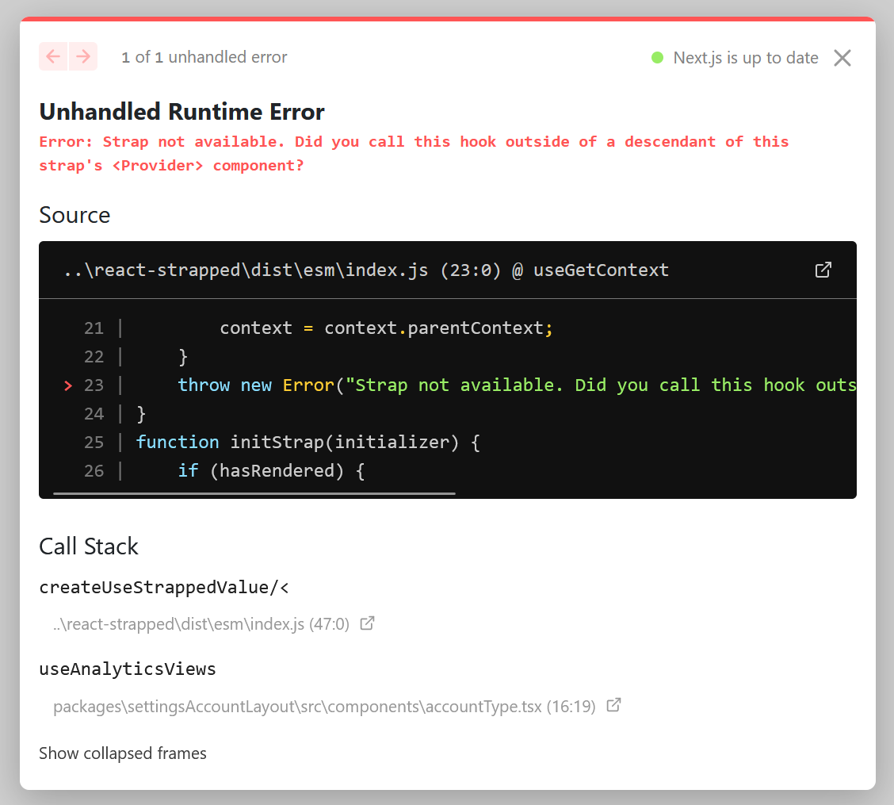

# React Strapped

<p align="center">
  
  <a href="https://bundlephobia.com/package/react-strapped">
    
  </a>
  <a href="https://github.com/nebrius/react-strapped/actions/workflows/tests.yml">
    
  </a>
</p>

React Strapped provides mechanisms that make it straightforward to initialize React with runtime bootstrap data in multi-page applications. React Strapped is intentionally small with no runtime dependencies.

- [Motivation](#motivation)
- [Installation](#installation)
- [Getting Started](#getting-started)
- [Multi-page Apps](#multi-page-apps)
- [Frequently Asked Questions](#frequently-asked-questions)
  - [Is it possible to reset bootstrap data?](#is-it-possible-to-reset-bootstrap-data)
  - [Can I reuse root atoms across different bootstrap roots?](#can-i-reuse-root-atoms-across-different-bootstrap-roots)
  - [Is Recoil Bootstrap server side rendering friendly?](#is-recoil-bootstrap-server-side-rendering-friendly)
  - [Is Recoil Bootstrap React Server Components friendly?](#is-recoil-bootstrap-react-server-components-friendly)
- [API Specification](#api-specification)
  - [`rootAtom(key)`](#rootatomkey)
  - [`bootstrappedAtom(rootAtom, options)`](#bootstrappedatomrootatom-options)
  - [`bootstrappedAtomValueHook(bootstrappedAtom)`](#bootstrappedatomvaluehookbootstrappedatom)
  - [`<BootstrapRoot bootstrapData={} rootAtom={}>...</BootstrapRoot>`](#bootstraproot-bootstrapdata-rootatombootstraproot)
- [License](#license)

## Motivation

React has a number of popular state management libraries, such as [Redux](https://react-redux.js.org/), [Zustand](https://github.com/pmndrs/zustand) [Jotai](https://jotai.org/), and [Recoil](https://recoiljs.org/). While each of these state management libraries brings their own opinions to state management, none of them have opinions on how to load bootstrap data. As we'll see later, this creates friction for developing modern applications.

Popular frameworks such as [Next.js](https://nextjs.org/) have given rise to what I call client-side multi-page applications. These applications blur the line between traditional multi-page applications (MPAs) and single-page applications (SPAs). Specifically, they inherit the routing and separation of concerns of traditional MPAs and combine it with client-side routing of SPAs.

While I'm a big fan of client-side MPAs, I've always struggled with bootstrap data that's generated during server side rendering (SSR). Bootstrap data in client-side MPAs typically have the following characteristics:
- Some data is always available on all pages.
    - Examples include: data about the current user, feature/experimentation flags, etc.
    - This data is always available, and can be consumed "no questions asked."
    - In Next.js, this data is typically populated via a centralized helper function that is called from [`getServerSideProps`](getServerSideProps).
- Other data is only available on certain pages.
    - Examples include settings information that's only available on a settings page, but not on the home page.
    - This data is _not_ available on all pages, and so care must be take to only access this data on the settings page.
    - In Next.js, this data is typically populated via one-off code in a specific page(s) [`getServerSideProps`](getServerSideProps) implementation.
- Bootstrap data is not available until the first render of the application.
    - In Next.js, bootstrap data generated in [`getServerSideProps`](getServerSideProps) is passed as component properties to the top level component.
    - The implication of this pattern is that any state management declared at module scope, such as `atom()` constructors in Jotai and Recoil, do not have access to this data at time of construction.
    - This limitation means we can't use typical state initialization techniques for these state management libraries.
- Data during SSR needs to be scoped to a React context and not be available globally.
    - A Next.js server is rendering multiple requests from multiple users more or less at once, meaning global data is not an option since it wouldn't be "scoped" to a specific user.
    - While it's possible to use global data safely in Next.js applications, it's _very_ tricky to completely prevent all data "leaks" at all times. As such, I think it's best to avoid as a whole.
     - This means we can't do tricks for Jotai/Recoil like creating a global promise we attach to each atom's initializer, and then resolving it once we get the bootstrap data.

Taking these characteristics into account when considering state management libraries, we end up with these requirements for state management:
1. Initialize the store/atoms/etc. synchronously during the first render
2. Allow global data to be used anywhere, but prevent page specific data from being used outside of that page
3. Only load state management code on a page if they are used on that page

Redux/Zustand handle requirement 1. well. Jotai/Recoil handle 1. and 3. well, but only if we're not trying to solve 2 (see https://github.com/nebrius/recoil-bootstrap#motivation for a more in-depth explanation why). None of these four handle 2. well.

React Strapped exists to handle all 3 points well. That said, React Strapped is _not_ a replacement for the four state management libraries mentioned, and is indeed intended to be used in conjunction with them. See [Linking to other state management libraries](#linking-to-other-state-management-libraries) for more information.

_Aside:_ This project grew out of [recoil-bootstrap](https://github.com/nebrius/recoil-bootstrap), a previous library I created to solve this problem with Recoil, because 1) I realized that the problem recoil-bootstrap solved isn't limited to Recoil and 2) Meta appears to have stopped investing in Recoil.

## Installation

Install React Strapped from npm with:

```
npm install react-strapped
```

## Getting Started

React Strapped works by creating a React context to hold bootstrap data, and special hooks for accessing this data. We call an instance of provider+hooks associated with a piece of bootstrap data a "strap." A "strap" is a related set of bootstrap data which can be accessed via special hooks created from the strap. Unlike other state management libraries, these contexts are intentionally designed so that more than one can be used at a time and with each other. We'll see this in action in the next section.

### Simple example

This example shows a minimal example using React Strapped. It's written in TypeScript to a) demonstrate how TypeScript types flows through the library and b) to give a sense of what data is expected where. You can absolutely use this library without using TypeScript though.

First, let's create our provider in a file called `state.ts`:

```tsx
import { createStrappedProvider } from 'react-strapped';

export interface MyBootstrapData {
  currentUser: {
    name: string;
    age: number;
  };
}

// First, we create the strap, which includes the context provider and some
// helper functions for creating hooks
const myStrap = createStrap<MyBootstrapData>();

// Next, export the provider to make data available to components
export const MyStrapProvider = myStrap.Provider;

// Finally create a hook for accessing the current user included in the
// bootstrap data. The callback is called once on first render to initialize the
// strap value for use later in the app.
export const useCurrentUser = myStrap.createUseStrappedValue(({currentUser}) => currentUser);
```

Now let's create some UI in a Next.js page component:

```tsx
import type { MyBootstrapData } from './state';
import { MyStrapProvider, useCurrentUser } from './state';

interface PageProps {
  bootstrapData: MyBootstrapData;
}

// If you're not familiar with Next.js, this function runs on a server and is
// responsible for fetching bootstrap data. The value of the `props` property is
// passed as props to the default export React component in this file.
export function getServerSideProps() {
  const props: PageProps = {
    bootstrapData: {
      currentUser: {
        name: 'Philip J Fry',
        age: 1_026,
      },
    },
  };
  return { props };
}

// This default export is the root component in a Next.js page. The props
// passed to this component come from the server via `getServerSideProps`
export default function MyApp({ bootstrapData }: PageProps) {
  return (
    // We include our strap provider and give it the bootstrap data. This
    // initializes data and make it immediately available for use via strap
    // hooks, e.g. `useCurrentUser`
    <MyStrapProvider bootstrapData={bootstrapData}>
      <MyComponent />
    </MyStrapProvider>
  );
}

function MyComponent() {
  // We use the hook created above, which makes sure that we're calling this
  // hook in a component with <MyStrapProvider> as a parent in the component tree
  const currentUser = useCurrentUser();
  return (
    // Prints "Hello Philip J Fry"
    <div>Hello {currentUser.name}</div>
  );
}
```

### Multi-page Apps

React Strapped is designed specifically for client-side multi-page applications, which React Straps supports via multiple Provider components. You can have as many providers as you want with any amount of nesting. All hooks associated with providers are available for use, regardless of where that provider sits in relation to other providers. This nesting works differently than e.g. Recoil, where you can either only access the root-most [`RecoilRoot`](https://recoiljs.org/docs/api-reference/core/RecoilRoot/), or the closest `RecoilRoot` if `override` is specified.

In multi-page applications, we often have a set of bootstrap data that is common to all pages as well as bootstrap data that is specific to a page. With React Strapped, you can create one provider for the common bootstrap data that exists on all pages, and then per-page providers that contain just those pages' data.

This would look like:

```tsx
// src/components/appWrapper.tsx
export function AppWrapper({ commonBootstrapData, children }) {
  // This component sets up the common provider and is included on all pages
  return (
    <MyCommonStrapProvider bootstrapData={commonBootstrapData}>
      {children}
    </MyCommonStrapProvider>
  );
}

// src/pages/my-page.tsx
export default function MyPage({ commonBootstrapData, myPageBootstrapData }) {
  return (
    // Include the common provider and any other common UI here
    <AppWrapper commonBootstrapData={commonBootstrapData}>
      {/* Add the page specific provider here */}
      <MyPageSpecificStrapProvider bootstrapData={myPageBootstrapData}>
        {/* SomeComponents has access to all hooks created with
            MyCommonStrapProvider _and_ MyPageSpecificStrapProvider */}
        <SomeComponents />
      </MyPageSpecificStrapProvider>
    </AppWrapper>
  )
}
```

If bootstrap data exists across a few pages, but not all, you can create a third bootstrap root that is shared between these pages.

When using multiple providers, hooks for accessing data provide guardrails against accessing data from the wrong place. If you try and call a strap hook based on `MyPageSpecificStrapProvider` on a different page, then you'll get a human readable error saying you're trying to access it from the wrong place, like so:

<br />
<p align="center">
  
</p>

For an in-depth example of a multi-page Next.js app using React Strapped, see my [jotai-prototyping](https://github.com/nebrius/jotai-prototyping) repository.

### Updating strap data after first render

React Strapped includes limited support for updating data. Each strapped set includes a helper function for creating a hook with the same signature as React's [`useState` hook](https://react.dev/reference/react/useState). We can modify the simple example from above as follows:

```tsx
const myStrap = createStrap<MyBootstrapData>();

export const MyStrapProvider = myStrap.Provider;

// Note how we call createUseStrappedState intsead of createUseStrappedValue
export const useCurrentUserState = myStrap.createUseStrappedState(({currentUser}) => currentUser);
```

And then in a UI component we can do:

```tsx
const [currentUser, setCurrentUser] = useCurrentUserState();
```

This setter is fairly limited however, and does not include the concept of asynchronous updates, reducers, chaining set values from other atoms/state, etc. If you need to make use of these features, I recommend pairing [Jotai](https://jotai.org/) with React Strapped.

## Frequently Asked Questions

### Is it possible to reset bootstrap data?

Yes. Add a `key` to the provider that will cause it to unmount and remount, which will reset the internal React context.

### Is React Strapped server side rendering friendly?

Yes. Initialization happens synchronously, so all data will be available for the single rendering pass that happens in server side rendering. All data is also contained inside of a React context, and so can't leak to other rendering passes.

### Is React Strapped React Server Components friendly?

Yes, ish. Recoil Bootstrap works just fine with React Server Components. Each server component that fetches bootstrap data can be assigned its own Provider to contain that component tree's bootstrap data.

The catch is that hooks cannot be used inside of React Server Components, meaning that React Strapped is limited to client-only components. React Strapped includes a `use client` directive in its implementation to force code that uses them to also be client-only.

## Linking to other state management libraries

### Jotai

Connecting a Jotai atom to React Strapped can be accomplished with the [`useHydrateAtoms` utility](https://jotai.org/docs/utilities/ssr).

```tsx
function RootishComponent() {
  const myFirstStrapValue = useStrapValue(); // Hook returned from a createUseStrappedValue() call
  const mySecondStrapValue = useStrapValue(); // Hook returned from another createUseStrappedValue() call
  useHydrateAtoms([
    [myFirstAtom, myFirstStrapValue],
    [mSecondAtom, mySecondStrapValue]
  ]);
}
```

Then you can use these as normal atoms.

Note: when connecting React Strapped and Jotai, you'll need to be careful where you put the Jotai Provider, since Jotai [does not supported nested providers](https://github.com/pmndrs/jotai/discussions/682) the same way React Strapped does. I recommend putting the Jotai Provider outside of the top-most React Strapped provider, just to be safe.

### Recoil

Unfortunately I was not able to create a way for this mechanism to work with Recoil, due to [this bug which has gone unanswered]().

### Others

I haven't experimented with Redux/Zustand and React Strapped, but I suspect it will be tricky to do. Redux and Zustand centralize store creation, meaning you can't do distributed initialization of slices/reducers across different layers of the app.

## API Specification

### `createStrap()`

Creates a strap. Data associated with this strap is typed as `BootstrapData`

```ts
export function createStrap<BootstrapData>(): {
  createUseStrappedState,
  createUseStrappedValue,
  Provider,
}
```

_**Props:**_

_none_

_**Returns:**_

An object with the three properties:

- `Provider`
- `createUseStrappedValue`
- `createUseStrappedState`

See below for more information on these properties.

### `<strap.Provider bootstrapData={}>...</BootstrapRoot>`

This component initializes the strap with the supplied bootstrap data.

```ts
function Provider({ children, bootstrapData, }: PropsWithChildren<{
    bootstrapData: BootstrapData;
}>): JSX.Element
```
_**Props:**_

`bootstrapData`: `BootstrapData`

The bootstrap data to initialize the strap with.

### `createUseStrappedValue(initializer)`

Creates a hook that returns the value created in the supplied initializer.

```ts
type Initializer<StrapValue, BootstrapData> = (
  bootstrapData: BootstrapData,
) => StrapValue;

function createUseStrappedValue<StrapValue>(initializer: Initializer<StrapValue, BootstrapData>): () => StrapValue;
```

_**Props:**_

`initializer`: `(bootstrapData: BootstrapData) => StrapValue`

The intializer is called during the first render of the Provider component associated with with this strap. The first argument passed to the intitializer is the same value passed in for the `bootstrapData` property on the Provider.

_**Returns:**_

A hook that return the value of the strap, as returned from the initializer.

_**Throws:**_

The returned hook will throw an exception if it is called from outside a descendant of the Provider component.

### `createUseStrappedState(initializer)`

Creates a hook that returns the value and a setter created in the supplied initializer.

```ts
type Initializer<StrapValue, BootstrapData> = (
  bootstrapData: BootstrapData,
) => StrapValue;

function createUseStrappedValue<StrapValue>(
  initializer: Initializer<StrapValue, BootstrapData>
): () => [value: StrapValue, setValue: (newValue: StrapValue) => void];
```

_**Props:**_

`initializer`: `(bootstrapData: BootstrapData) => StrapValue`

The intializer is called during the first render of the Provider component associated with with this strap. The first argument passed to the intitializer is the same value passed in for the `bootstrapData` property on the Provider.

_**Returns:**_

A hook that return the value of the strap, as returned from the initializer, and a setter to update the value of this strap.

_**Throws:**_

The returned hook will throw an exception if it is called from outside a descendant of the Provider component.

## License

MIT License

Copyright (c) 2023 Bryan Hughes

Permission is hereby granted, free of charge, to any person obtaining a copy
of this software and associated documentation files (the "Software"), to deal
in the Software without restriction, including without limitation the rights
to use, copy, modify, merge, publish, distribute, sublicense, and/or sell
copies of the Software, and to permit persons to whom the Software is
furnished to do so, subject to the following conditions:

The above copyright notice and this permission notice shall be included in all
copies or substantial portions of the Software.

THE SOFTWARE IS PROVIDED "AS IS", WITHOUT WARRANTY OF ANY KIND, EXPRESS OR
IMPLIED, INCLUDING BUT NOT LIMITED TO THE WARRANTIES OF MERCHANTABILITY,
FITNESS FOR A PARTICULAR PURPOSE AND NONINFRINGEMENT. IN NO EVENT SHALL THE
AUTHORS OR COPYRIGHT HOLDERS BE LIABLE FOR ANY CLAIM, DAMAGES OR OTHER
LIABILITY, WHETHER IN AN ACTION OF CONTRACT, TORT OR OTHERWISE, ARISING FROM,
OUT OF OR IN CONNECTION WITH THE SOFTWARE OR THE USE OR OTHER DEALINGS IN THE
SOFTWARE.

[getServerSideProps]: https://nextjs.org/docs/pages/api-reference/functions/get-server-side-props
